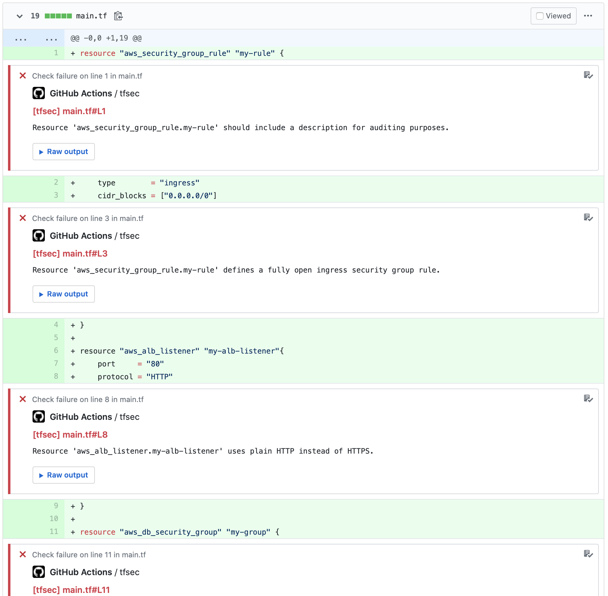
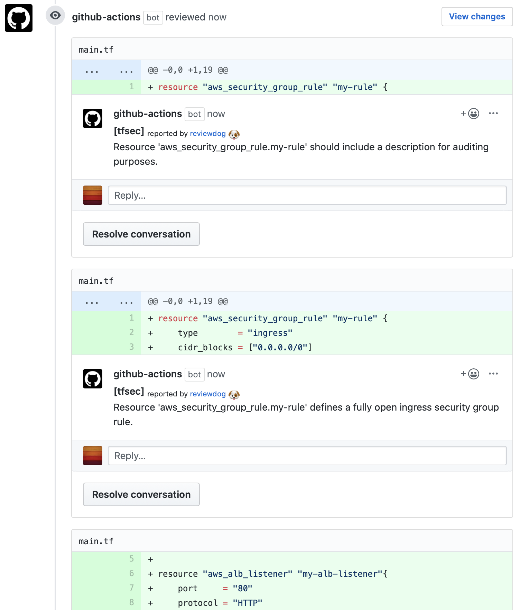

# GitHub Action: Run trivy with reviewdog

[](https://github.com/reviewdog/action-tfsec/actions?query=workflow%3ATests)
[](https://github.com/reviewdog/action-tfsec/actions?query=workflow%Lint)
[](https://github.com/reviewdog/action-tfsec/actions?query=workflow%3Adepup)
[](https://github.com/reviewdog/action-tfsec/actions?query=workflow%3Arelease)
[](https://github.com/reviewdog/action-tfsec/releases)
[](https://github.com/haya14busa/action-bumpr)

This action runs [trivy](https://github.com/aquasecurity/trivy) with
[reviewdog](https://github.com/reviewdog/reviewdog) on pull requests
to enforce best practices.

## Examples

### With `github-pr-check`

By default, with `reporter: github-pr-check` an annotation is added to
the line:



### With `github-pr-review`

With `reporter: github-pr-review` a comment is added to
the Pull Request Conversation:



## Inputs

### `github_token`

**Required**. Must be in form of `github_token: ${{ secrets.github_token }}`.

### `working_directory`

Optional. Directory to run the action on, from the repo root.
The default is `.` ( root of the repository).

### `level`

Optional. Report level for reviewdog [`info`,`warning`,`error`].
It's same as `-level` flag of reviewdog.
The default is `error`.

### `tool_name`

Optional. Name of the tool being used. This controls how it will show up in the GitHub UI.
The default is `trivy`.

### `reporter`

Optional. Reporter of reviewdog command [`github-pr-check`,`github-pr-review`].
The default is `github-pr-check`.

### `filter_mode`

Optional. Filtering for the reviewdog command [`added`,`diff_context`,`file`,`nofilter`].

The default is `added`.

See [reviewdog documentation for filter mode](https://github.com/reviewdog/reviewdog/tree/master#filter-mode) for details.

### `fail_on_error`

Optional. Exit code for reviewdog when errors are found [`true`,`false`].

The default is `false`.

See [reviewdog documentation for exit codes](https://github.com/reviewdog/reviewdog/tree/master#exit-codes) for details.

### `flags`

Optional. Additional reviewdog flags. Useful for debugging errors, when it can be set to `-tee`.
The default is ``.

### `trivy_version`

Optional. The version of tfsec to install.
The default is `latest`.

### `trivy_flags`

Optional. List of arguments to send to trivy.
For the output to be parsable by reviewdog [`--format=checkstyle` is enforced](./entrypoint.sh).
The default is ``.

## Outputs

## `trivy-return-code`

The `trivy` command return code.

## `reviewdog-return-code`

The `reviewdog` command return code.

## Example usage

```yml
name: trivy
on: [pull_request]
jobs:
  trivy:
    name: runner / trivy
    runs-on: ubuntu-latest # Windows and macOS are also supported

    steps:
      - name: Clone repo
        uses: actions/checkout@v4

      - name: Run trivy with reviewdog output on the PR
        uses: reviewdog/action-trivy@master
        with:
          github_token: ${{ secrets.github_token }}
          working_directory: my_directory # Change working directory
          level: info # Get more output from reviewdog
          reporter: github-pr-review # Change reviewdog reporter
          filter_mode: nofilter # Check all files, not just the diff
          fail_on_error: true # Fail action if errors are found
          flags: -tee # Add debug flag to reviewdog
          trivy_flags: "" # Optional
```

## Development

### Release

#### [haya14busa/action-bumpr](https://github.com/haya14busa/action-bumpr)

You can bump version on merging Pull Requests with specific labels (bump:major,bump:minor,bump:patch).
Pushing tag manually by yourself also work.

#### [haya14busa/action-update-semver](https://github.com/haya14busa/action-update-semver)

This action updates major/minor release tags on a tag push. e.g. Update v1 and v1.2 tag when released v1.2.3.
ref: <https://help.github.com/en/articles/about-actions#versioning-your-action>

### Lint - reviewdog integration

This reviewdog action template itself is integrated with reviewdog to run lints
which is useful for Docker container based actions.

Supported linters:

- [reviewdog/action-shellcheck](https://github.com/reviewdog/action-shellcheck)
- [reviewdog/action-hadolint](https://github.com/reviewdog/action-hadolint)
- [reviewdog/action-misspell](https://github.com/reviewdog/action-misspell)

### Dependencies Update Automation

This repository uses [haya14busa/action-depup](https://github.com/haya14busa/action-depup) to update
reviewdog version.
